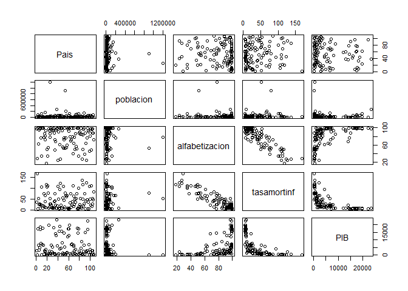
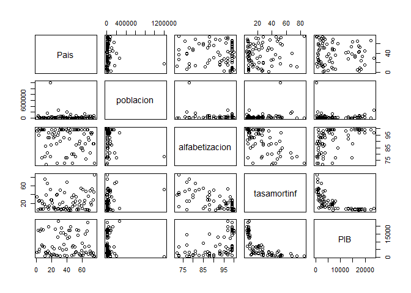
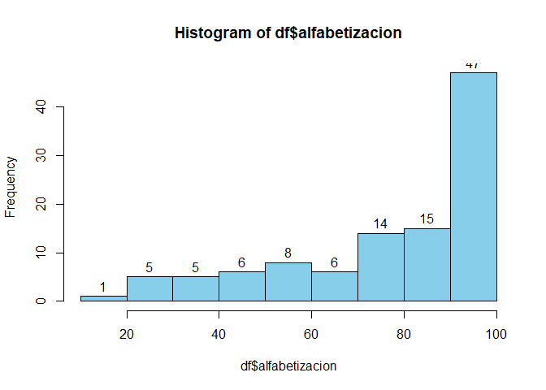

practica\_que\_jaléxd
================
Vanessa
24/6/2021

*Primera Práctica calificada*


``` r
#Vanessa Nina 14160173
#1)
a<-10000%%3
a #es lo que sobra al repartir 10000$ entre 3 personas
```

    ## [1] 1

``` r
#2)
4560%%3 #si es divisible por 3 porque su residuo es cero
```

    ## [1] 0

``` r
#3)
b<- c(2:87)
b[b%%7==0]
```

    ##  [1]  7 14 21 28 35 42 49 56 63 70 77 84

``` r
#4)

c<- c(7:3)
d<-c(seq(from=5, to=25, by=5))
condiA <- ifelse(c%%2==0, "TRUE", "FALSE")
condiB <- ifelse(d>10, "TRUE", "FALSE")
data.frame(condiA,condiB)#en la cuarta posicion se cumplen ambas condiciones
```

    ##   condiA condiB
    ## 1  FALSE  FALSE
    ## 2   TRUE  FALSE
    ## 3  FALSE   TRUE
    ## 4   TRUE   TRUE
    ## 5  FALSE   TRUE

``` r
#5)
S <- (1:100)
sum(1:100)
```

    ## [1] 5050

``` r
sum_s<- (100*101)/2
sum_s
```

    ## [1] 5050

``` r
## la suma es 5050, usando sumatoria y la fórmula

#6)
e<-c(1, -4, 5, 9, -4)
min(e)
```

    ## [1] -4

``` r
nivel<-c(1, -4, 5, 9,-4)
nivel[2]
```

    ## [1] -4

``` r
nivel[5]
```

    ## [1] -4

``` r
ifelse(e==min(e), "ValorMinimo", "***")
```

    ## [1] "***"         "ValorMinimo" "***"         "***"         "ValorMinimo"

``` r
#7)
factorial(8)
```

    ## [1] 40320

``` r
#8)
x<- 3:7
sum(exp(x))
```

    ## [1] 1723.159

``` r
#9)
y<-1:10
prod(log(sqrt(y)))
```

    ## [1] 0

``` r
#10)

R=25
teta= 10 #grados
d=R/2
ar1 <- function(R,teta){
  result <- (((pi*(R^2))*teta)/360)
  return(result)
}
area1 <- ar1(R,teta)
area1
```

    ## [1] 54.54154

``` r
ar2 <- function(d,R){
  result2 <- (sqrt(R^2 - d^2))
  return(result2)
}
area2 <-ar2(d,R)
area2
```

    ## [1] 21.65064

``` r
ar_final <- area1 - area2
ar_final
```

    ## [1] 32.8909

``` r
#11)

n<- c(5:15)
n
```

    ##  [1]  5  6  7  8  9 10 11 12 13 14 15

``` r
ninvert<- c(15:5)
ninvert
```

    ##  [1] 15 14 13 12 11 10  9  8  7  6  5

``` r
n<- c(5:15)
rev(n)#resulta lo mismo que al invertirlo usar la función rev
```

    ##  [1] 15 14 13 12 11 10  9  8  7  6  5

``` r
#12)
w<- 10:100
sum(w^3+ 4*w^2)
```

    ## [1] 26852735

``` r
#13)
z<- 1:25
sum(2^z/z +3^z/z^2)
```

    ## [1] 2129170437

**Ahora crearemos gráficos aprovechando el data frame de la pregunta
N°14**

``` r
#14)
df<-read.csv("https://raw.githubusercontent.com/fhernanb/datos/master/Paises.txt",sep="",dec=".")
View(df)
plot(df)
```

<!-- -->

``` r
alta<-subset(df, alfabetizacion >=70)
plot(alta)
```

<!-- -->

``` r
x<- alta$Pais
y<- alta$alfabetizacion

hist(df$alfabetizacion, freq = T, col = "skyblue", labels = T)
```

<!-- -->

``` r
#primer 
length(df)
```

    ## [1] 5

``` r
#segundo
length(df[,1])
```

    ## [1] 107

``` r
#tercero
df[df$poblacion==max(df[,2]),]
```

    ##      Pais poblacion alfabetizacion tasamortinf PIB
    ## 25 China_   1205200             78          52 377

``` r
#cuarto
df[df$alfabetizacion==min(df[,3]),]
```

    ##            Pais poblacion alfabetizacion tasamortinf PIB
    ## 19 Burkina_Faso     10000             18         118 357

``` r
#15
df<-mtcars
df[df$mpg<18.0,]
```

    ##                      mpg cyl  disp  hp drat    wt  qsec vs am gear carb
    ## Duster 360          14.3   8 360.0 245 3.21 3.570 15.84  0  0    3    4
    ## Merc 280C           17.8   6 167.6 123 3.92 3.440 18.90  1  0    4    4
    ## Merc 450SE          16.4   8 275.8 180 3.07 4.070 17.40  0  0    3    3
    ## Merc 450SL          17.3   8 275.8 180 3.07 3.730 17.60  0  0    3    3
    ## Merc 450SLC         15.2   8 275.8 180 3.07 3.780 18.00  0  0    3    3
    ## Cadillac Fleetwood  10.4   8 472.0 205 2.93 5.250 17.98  0  0    3    4
    ## Lincoln Continental 10.4   8 460.0 215 3.00 5.424 17.82  0  0    3    4
    ## Chrysler Imperial   14.7   8 440.0 230 3.23 5.345 17.42  0  0    3    4
    ## Dodge Challenger    15.5   8 318.0 150 2.76 3.520 16.87  0  0    3    2
    ## AMC Javelin         15.2   8 304.0 150 3.15 3.435 17.30  0  0    3    2
    ## Camaro Z28          13.3   8 350.0 245 3.73 3.840 15.41  0  0    3    4
    ## Ford Pantera L      15.8   8 351.0 264 4.22 3.170 14.50  0  1    5    4
    ## Maserati Bora       15.0   8 301.0 335 3.54 3.570 14.60  0  1    5    8

``` r
df[df$cyl==4,]
```

    ##                 mpg cyl  disp  hp drat    wt  qsec vs am gear carb
    ## Datsun 710     22.8   4 108.0  93 3.85 2.320 18.61  1  1    4    1
    ## Merc 240D      24.4   4 146.7  62 3.69 3.190 20.00  1  0    4    2
    ## Merc 230       22.8   4 140.8  95 3.92 3.150 22.90  1  0    4    2
    ## Fiat 128       32.4   4  78.7  66 4.08 2.200 19.47  1  1    4    1
    ## Honda Civic    30.4   4  75.7  52 4.93 1.615 18.52  1  1    4    2
    ## Toyota Corolla 33.9   4  71.1  65 4.22 1.835 19.90  1  1    4    1
    ## Toyota Corona  21.5   4 120.1  97 3.70 2.465 20.01  1  0    3    1
    ## Fiat X1-9      27.3   4  79.0  66 4.08 1.935 18.90  1  1    4    1
    ## Porsche 914-2  26.0   4 120.3  91 4.43 2.140 16.70  0  1    5    2
    ## Lotus Europa   30.4   4  95.1 113 3.77 1.513 16.90  1  1    5    2
    ## Volvo 142E     21.4   4 121.0 109 4.11 2.780 18.60  1  1    4    2

``` r
df[df$wt>2.500&df$am==1,]
```

    ##                 mpg cyl disp  hp drat    wt  qsec vs am gear carb
    ## Mazda RX4      21.0   6  160 110 3.90 2.620 16.46  0  1    4    4
    ## Mazda RX4 Wag  21.0   6  160 110 3.90 2.875 17.02  0  1    4    4
    ## Ford Pantera L 15.8   8  351 264 4.22 3.170 14.50  0  1    5    4
    ## Ferrari Dino   19.7   6  145 175 3.62 2.770 15.50  0  1    5    6
    ## Maserati Bora  15.0   8  301 335 3.54 3.570 14.60  0  1    5    8
    ## Volvo 142E     21.4   4  121 109 4.11 2.780 18.60  1  1    4    2
